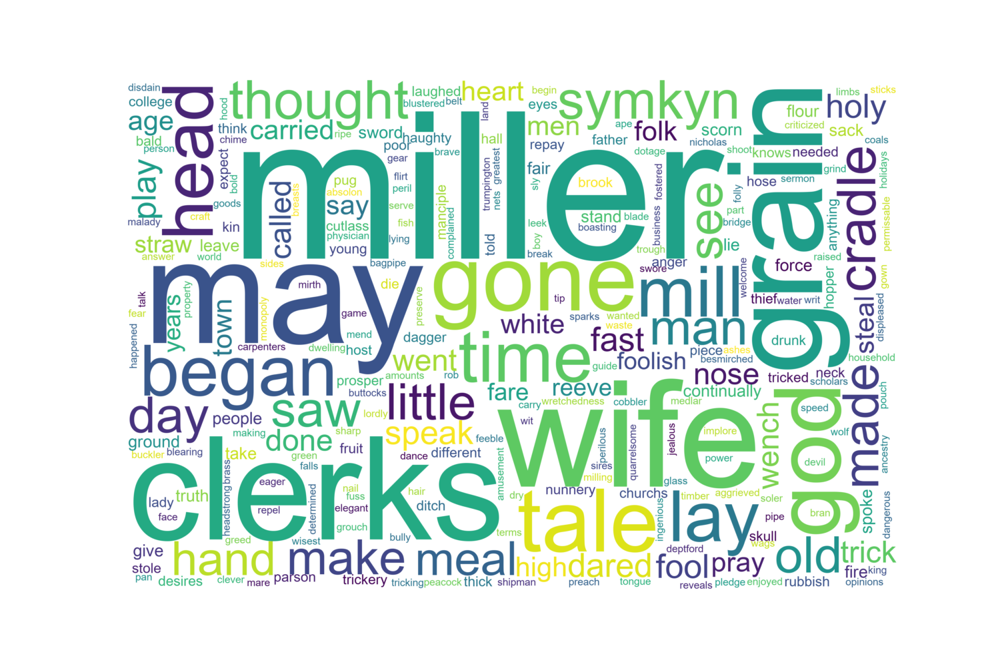

# WomensLit
 

<h3>graph.html:</h3> A massive visual that displays the connections between words in the Reeve's Tale. This file can be downloaded and displayed in a browser. 
<h3>network_maker.py:</h3> Program that creates the <strong>graph.html</strong> file using Pyvis. 
<h3>word_cloud.py:</h3> Program that creates a wordcloud using the wordcloud library. The output file is <strong>reeve_wordcloud.png</strong>.
<h3>reeve_network.py:</h3> Program that creates png and txt files to display networks between nouns and adjectives and verbs as well as nouns and other nouns in the Reeve's Tale. This generates <strong>reeves_network_complete.txt, reeves_network_complete.txt, reeve_noun.png, reeve_noun_circ.png, reeve_circ.png</strong>
<h3>reeves_network txt files:</h3>These are two of the output files of reeve_network.py. They contain displays of the dictionaries that form the text networks.
<h3>list_creator.py:</h3> Program that turns plain text into a list with quotes to indicate the word is a string in Python. Input is: <strong>speech_non_lists.txt> and the output looks like <strong>speech_lists.txt</strong>
<h3>frequency.py:</h3> Program that prints the sorted number of appearances of words in the Reeve's Tale. It excludes basic and frequency used words like "a", "the" and "in".
 <h3>reeves_tale.txt:</h3> Text of the Reeve's Tale.
